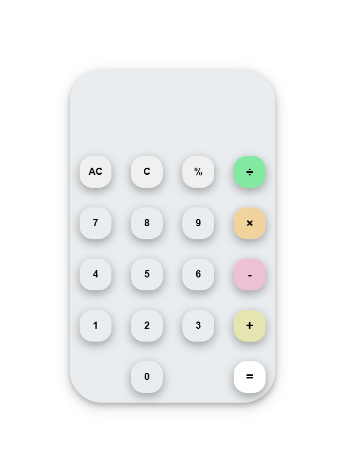

# Calculator with js

This is a solution to the Calculator with JavaScript.

## Table of contents

- [Overview](#overview)
  - [Screenshot](#screenshot)
  - [Links](#links)
- [My process](#my-process)
  - [Built with](#built-with)
  - [What I learned](#what-i-learned)
  - [Useful resources](#useful-resources)
- [Author](#author)

## Overview

It's my first JS project.

### Screenshot



### Links

- Solution URL: [Calculator](https://theplator.github.io/Calculator_with_js/)

### Built with

- HTML
- CSS
- JavaScript

### What I learned

I learn the New way to center the div.
To see how you can add code snippets, see below:

```CSS
div{
 position: fixed;
  left: 50%;
  top: 50%;
  transform: translate(-50%, -50%);
}
```

### Useful resources

-[box-shadow](https://getcssscan.com/css-box-shadow-examples) This helped me for box-shadow. I really liked this pattern and will use it going forward.

## Author

- Linkedin - [Sameer](https://www.linkedin.com/in/sameer-pce/)
- Frontend Mentor - [@ThePlator](https://www.frontendmentor.io/profile/ThePlator)
- GitHub - [@ThePlator](https://github.com/ThePlator)
